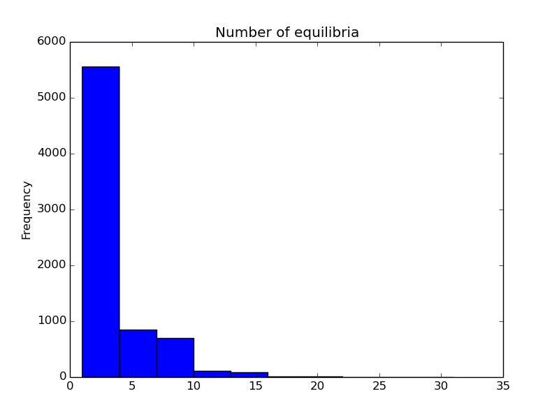
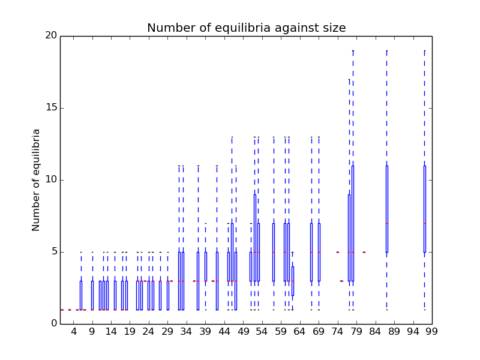
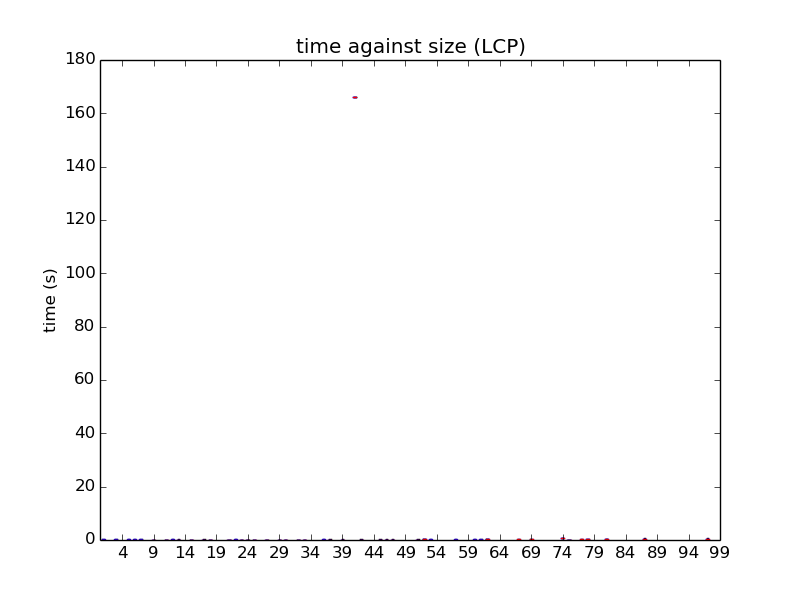
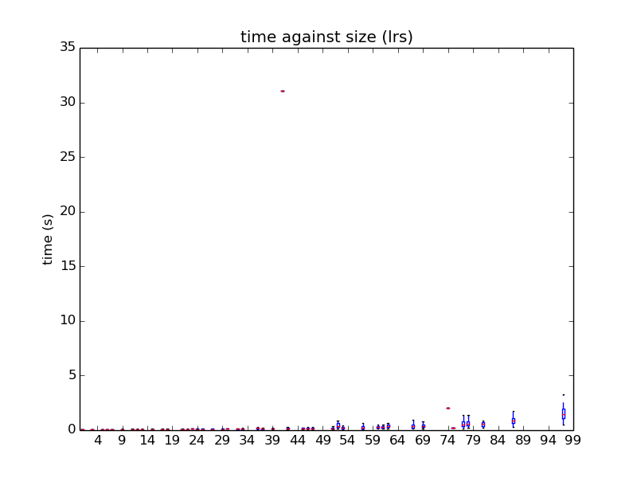
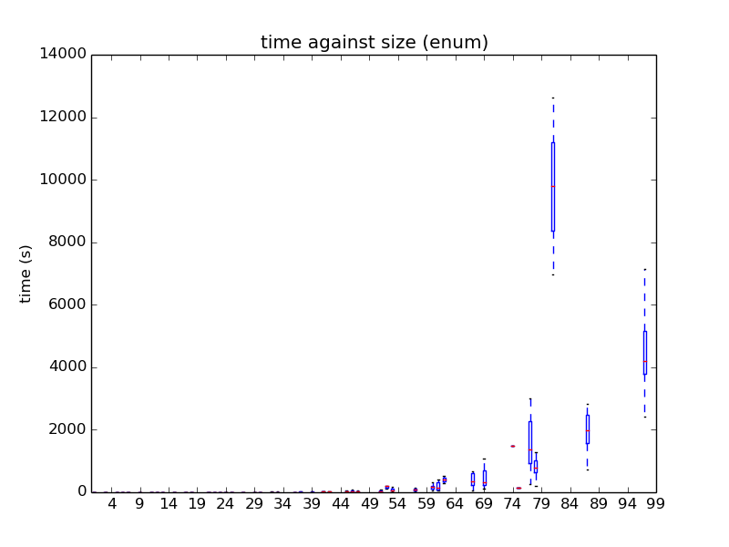

Game Theory Analysis
====================

This repository is for testing and analysing the code written for Sage Mathematical Software which can be found at https://github.com/theref/sage-game-theory

The main script (once the correct version of `sage` is installed) to run is `script.sage`. This will create random games, solve them with 3 algorithms and write them to a `log.csv` file.

Various things are collected, mainly including the run time for 3 algorithms (LCP, lrs and support enumeration) and the actual Nash Equilibria calculated for each algorithm.

The `analysis.py` script creates a variety of graphical outputs:

# The distribution of the size of games considered:

# The number of equilibria per dimension of games:

# The time against size per algorithm:

## LCP

## lrs

## Support enumeration

There are a variety of others outputs in the `./plots` directory.

# Degeneracy

The points at which the algorithms do not agree correspond to degenerate games, these are written to the `./plots/fails.csv` file.
